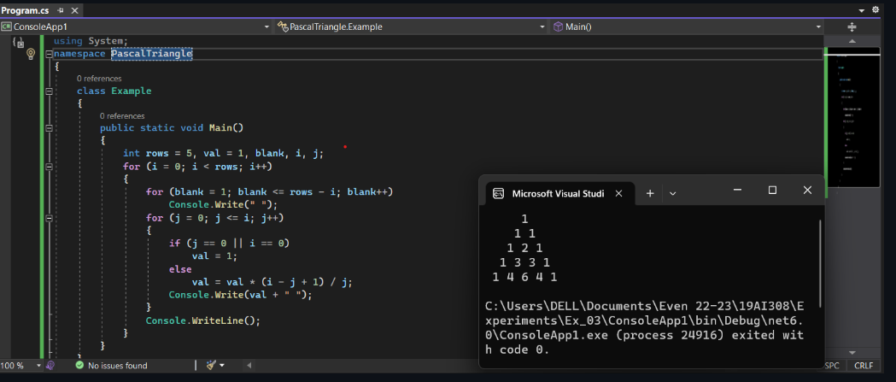

# Pattern

## Aim:
To write a C# program to execute a C pattern.
## Algorithm:
Step 1 :
Start the execution.

Step 2 :
Declare the required integer variables.

Step 3 :
Initialize the value of the variable as 0 for i and j.

Step 4 :
Enter the limits and initialize a for loop for the concept of pascal's triangle.

Step 5 :
Stop the execution.
## Program:
~~~
using System;
namespace PascalTriangle
{
    class Example
    {
        public static void Main()
        {
            int rows = 5, val = 1, blank, i, j;
            for (i = 0; i < rows; i++)
            {
                for (blank = 1; blank <= rows - i; blank++)
                    Console.Write(" ");
                for (j = 0; j <= i; j++)
                {
                    if (j == 0 || i == 0)
                        val = 1;
                    else
                        val = val * (i - j + 1) / j;
                    Console.Write(val + " ");
                }
                Console.WriteLine();
            }
        }
    }
}
~~~
## Output:

## Result:
Thus, a C# program to display a Pascal triangle pattern is executed successfully.
